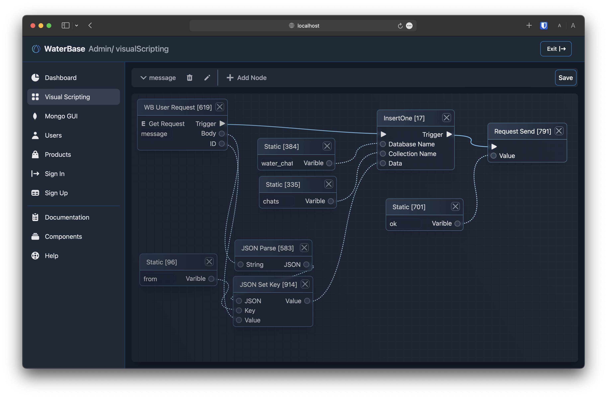

# waterbase

 <!-- You can include a logo here if available -->

`waterbase` is a programming system based on Node.js with a graphical interface. It allows programming states and functions via a web interface, and the waterbase system operates according to this programming. It's developed specifically for IoT and simple backend applications.

 <!-- You can include a screenshot here if available -->

## Features

- Programming capability via a web interface
- Flexible management of states and functions
- Enhanced performance with Node.js infrastructure

## How to Run

To run the project, follow these steps:

1. Use the `npm install` command to install necessary dependencies.
2. Then, execute `npm start` to initiate the project.

## License

This project is licensed under the MIT License.